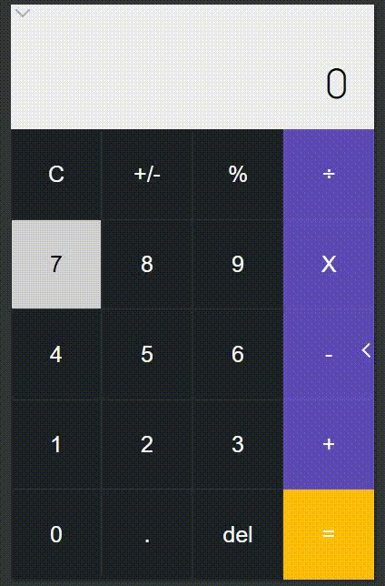

# Pure-Javascript-Calculator

A web calculator made entirely with pure Javascript, CSS and HTML (no frameworks).

    

## Table Of Contents
- [Description](#Description)
- [Getting Started](Getting Started)
- [Authors](#Authors)

## Description
aa
## Getting Started
aa
## Authors
- bruno-slv
